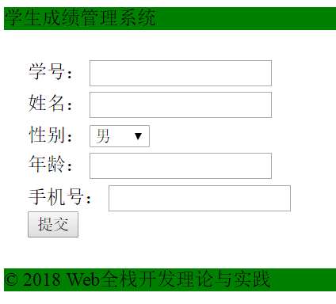
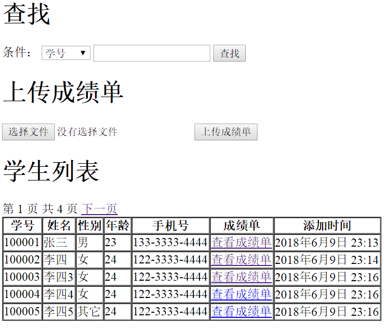
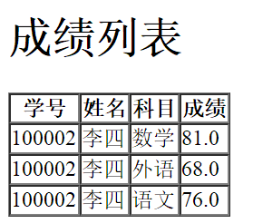

## WEBhw06
将课件中的mysite站点继续完善，增加如下功能：  
1、学生信息列表中增加搜索功能，可按照学号、姓名、手机号搜索；   
2、学生信息列表中增加分页功能，每页展示30名学生；  
3、学生信息列表中增加“上传成绩单”按钮，可上传 excel 格式的成绩单。成绩单供3列，分别为学号、科目、成绩，excel 解析可使用 openpyxl 。  
4、学生信息列表中增加一列“成绩单”，可以链接查看该学生的成绩单；   

----------
### 0 增加单个学生功能
http://127.0.0.1:8000/transcript/student/add/  

### 1 增加搜索功能，可按照学号、姓名、手机号搜索
### 2 增加分页功能，每页展示5名学生；
### 3 增加“上传成绩单”按钮  

### 4 增加一列“成绩单”  

